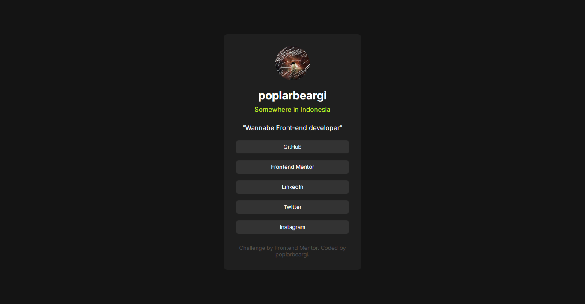

# Frontend Mentor - Social links profile solution

This is a solution to the [Social links profile challenge on Frontend Mentor](https://www.frontendmentor.io/challenges/social-links-profile-UG32l9m6dQ). Frontend Mentor challenges help you improve your coding skills by building realistic projects. 

## Table of contents

- [Overview](#overview)
  - [The challenge](#the-challenge)
  - [Screenshot](#screenshot)
  - [Links](#links)
- [My process](#my-process)
  - [Built with](#built-with)
  - [What I learned](#what-i-learned)
  - [Continued development](#continued-development)
- [Author](#author)

## Overview

### The challenge

Users should be able to:

- See hover and focus states for all interactive elements on the page

### Screenshot

### Links

- [Solution](https://www.frontendmentor.io/solutions/social-links-profile-4kdlAyZUBV)
- [Live Site](https://poplarbeargi.github.io/Social-links-profile/)

### Built with

- Semantic HTML5 markup
- CSS custom properties
- Flexbox

### What I learned

not a major thing but I learned some of Flexbox properties and how it works.

### Continued development

in the future, I want to include animations.

## Author

[@poplarbeargi](https://www.frontendmentor.io/profile/poplarbeargi)
